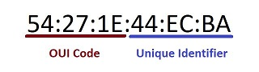

# DHCP log analysis #
## Project Status ##
The project was made successfully based on the assumptions listed in redme.md. The prototype works generally flawlessly, although the main.py file located in the main directory could separate some of the code into separate functions, which could be more appreciated when working with a larger group of programmers on the project.
#
## Project Limitation ##
The biggest struggle in the project was creating separate modules in the Sources directory to be imported into main.py. Unfortunately, the variables assigned to them could not find the correct connection with the code in other files, which made even more involvement in overwriting the code and defining more new variables.

It was decided to extract and save in separate files only those functions that would not make too much clutter and ensure full functionality at the same time. They are located in the Sources directory
#
## Nodes information ##
The assumption of the project was to find information about devices in the network traffic from the provided dhcpd.log file.

For the most detailed listing of these devices, efforts were made to find:
### Mac Adress ###
The MAC (Medium Access Control) address is a unique identification number assigned by manufacturers to each network device (e.g. a network adapter). It is used to control access to the media.
### IPv4 ###
The structure of the IPv4 address is 32-bit. The address is divided into four bytes. Due to their 8-bit structure, they are called octets. Each of them is written as numbers from 0 to 255. An example IPv4 address can therefore take the form 0.0.0.0., 1.2.3.4., 33.44.55.66., etc. The whole is called a header. Its individual components inform about the used version of the protocol, its sender, recipient, etc.
Due to the difficulty of remembering long sequences of numbers, IANA decided to fragment them. That is why the following bits are separated by dots. Importantly, IPv4 addresses are always only composed of numbers.
### Hostname ###
Hostname is the name of the device connected to the network.

### Organization Unique Identifier (OUI) ###
The OUI is a code embedded in the first three bytes (24 bits) of the MAC address. Identifies the vendor of the device. For example, if the first three bytes of the network card are 3C: FD: FE, the card was manufactured by Intel.

### Absence of information ###
For some interesting nodes, some information is missing from the provided logs. In this case, on the row next to this node, the information is not specified or the message "not presented" appears.
#
## The mechanism of how the code works ###
The script in the "main.py" file collects most of the code and has specified a value or calculations for many variables. The "os.path" module has been imported for the functionality of the script.
The log file (dhcpd.log) has been loaded using the function "open". List analysis begins with isolate the rows containing "DHCPACK" from the rest and start at the 34th character. The code clearly illustrates what values, when and under what conditions are assigned. Attempts were made to comment on every action of the script.

The main code also imports the functions contained in files in the Sources directory. 

One of them named "remove_brackets.py removes unnecessary brackets , giving the list a more aesthetic appearance. 

Another is a dictionaries list that contains OUI numbers and their assigned OEM. By using the formula for calculating the OUI from the MAC address found, the main code is able to find and compare the value of the OUI in this list and read the corresponding manufacturer name.

The final product of this project is a list of nodes saved in the nodes.csv file, located in the Results directory; if there is no directory or file, the program creates them after execution.
Output is created in both, in the terminal and in the file through separate "print" functions.

To avoid duplicating nodes of interest, a function has been created in a file named remove_duplicates.py. This function checking whether an identical node (identical lines) has been added to the list. The file with this function was imported at the end of the code in main.py. After successive runs of the program, new lines are added to the list. During one execution of the code, the list is created / nodes appended, and then opened again to check for duplicates and, if they exist, delete them from the list.

## Tests ##
All tests have an executable file with the extension "bat" (Windows batch file).
Three of them were written to display a single piece of information about the devices contained in the logs from the dhcpd.log file.

The file "host_test.py" displays information about the hosts read from each row. If they do not apply to the DHCPACK, or their name has not been found, an adequate message appears.

The file "ipv4_test.py" displays information on all unique IPv4 addresses

The file "mac_test.py" gives information on all unique MAC addresses.

Another is "oui_test.py" which displays the entire list of OUIs and their associated OEMs.

The final test code is "remove_brackets.py", which simply shows the use of functions for removing brackets contained in lines of text.

## Examples of Code ##
The Examples directory contains a Python executable named working_loop.py. This is a different completed version of the script for project; the code runs in a loop like main.py but does not import modules. This is an example of a working script, written a bit sloppy, and is an example of code to modify. Note that executing this code creates a nodes.csv file in the root directory.