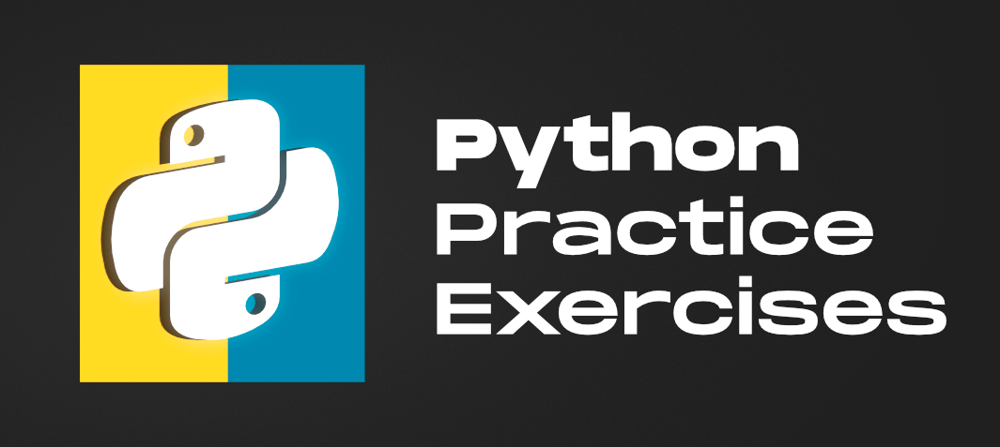

# Python Exercises #
## A Practical Guide to Python Scripting ##

This study will help understand scripting in the Python programming language. There are 12 Walkthroughs included, each containing separate scripting files, an effort has been made to comment each of the codes. These tasks were part of the Infrastructure as Code module from PGdip in Cloude Computing at Atlantic Technological University.
#
## Getting Started ##
Python version 3.10 is required to run all scripts correctly.
#
## Project composition ##
The project comprises one category, which is directories with script files written in Python. The directories are staggered in sequence. It is recommended to go through them all in order. Directories starting with the name "Exercises_" and subordinate to walkthroughs numbers.
#
### Walkthroughs 01 - Python Assignments and Variables
###  
- This exercises mainly focusing at data types, arithmetic operations, and how to use them in correct way. First 
scripts are written and saved, ready for testing. There are also some valuable tips, 
such as creating spaces, displaying program results on a new line, or replacing letters with uppercase 
or lowercase.

### Walkthroughs 02 - Documentation ###
- This section suggests how to use good programming practice and comment lines of code. A very 
useful thing, especially when just starting to program or reverting to code after a long time.

### Walkthroughs 03 - Data Structures ###
- This ones demonstrate the use of mutable and immutable (tuples) lists.

### Walkthroughs 04 - Loops and Statements ###
- This part of learning Python programming shows what loops are and how you can use them in your code.

### Walkthroughs 05 - Functions ###
- This walkthrough introduces functions in Python, how it works, and how to return a value. This part 
also explained what Tuple Unpacking is or how to use Scope.

### Walkthroughs 06 - Modules and Packages ###
- This walkthrough is about the functionality of modules, standard libraries and packages.

### Walkthroughs 07 - Handling Errors ###
- This part of the work focused on avoiding errors in the output code by introducing additional functions in the script. Examples of instructions in this document showed how to write a script so that in the event of incorrect input of variables, the program could notify the user that the entered data was incorrect and prompt what is the correct one
### Walkthroughs 08 - OO Coding ###
- This part of the exercises is based on classes and code automation.

### Walkthroughs 09 - Writing Tests ###
- The purpose of these tasks is to familiarize with the method of eliminating inconsistencies in the code and its ordering, adding appropriate variables, descriptions and making the code 100% readable.
### Walkthroughs 10 - Logging and Time ###
- The scripts contained in this folder were used to retrieve and display system information and system logs. A script was also made to display the current date and time in a suitable, readable format.
### Walkthroughs 11 - Network Utilities ###
- This Catalog presents automated scripts using Internet Protocols (TCP, UDP), Broadcasts and File Transfer Protocol (FTP)
### Walkthroughs 12 - Creating a project with Python ###
- The Last Walkthrough Includes instructions on how to write bash code and use it to build a simple project.
#
## Assumptions ##
The assumption of the project is to hand it over to interested parties for testing, modification and proposing alternative solutions.
It should be remembered, due to good practice, that the code should be written in a clear and effective way.
#
## References ##
[lyitbb.blackboard](https://lyitbb.blackboard.com/ultra/courses/_58891_1/cl/outline)

