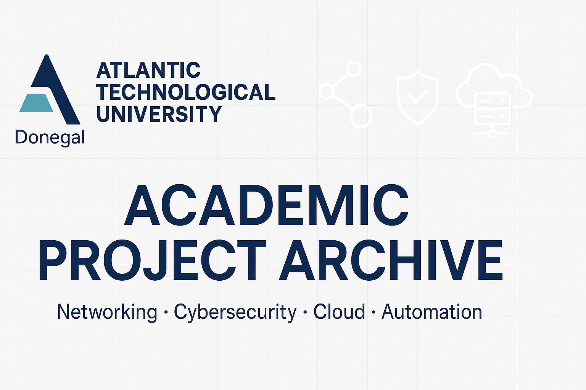

# Academic Project Archive — Konrad Jeziorski

Featuring academic projects centered on networking, cybersecurity, and cloud technologies, offering practical solutions and insights for education.

  

## 📚 Contents

This repository gathers selected academic and internship projects completed during my studies at **Atlantic Technological University**. The projects showcase practical skills in:

- Networking (LAN/WAN, routing, segmentation)
- Cybersecurity (FortiGate, secure topologies)
- Cloud and Virtualization (VMware, Hyper-V)
- Scripting and Automation (PowerShell, Python)

Each folder below contains detailed documentation and configurations related to a project.

| # | Project | Description |
|---|---------|-------------|
| 1 | [`VMware vSAN Cluster and Domain Controller Configuration`](./VMware-vSAN-Cluster-and-Domain-Controller-Configuration) | Standard Operating Procedure (SOP) for deploying a VMware vSAN cluster with an integrated Domain Controller. Covers virtual infrastructure setup, initial configuration, high availability testing, and performance validation in a virtualized lab environment. |
| 2 | [`Hyper-V Cluster and Domain Controller Setup on Windows Server`](./Cluster-and-Domain-Controller-Configuration-for-Hyper-V-Environments) | Complete SOP with verification evidence for building a Windows Server 2016-based Hyper-V failover cluster with shared storage and a Domain Controller. Includes detailed, step-by-step configuration, deployment validation, and cluster management instructions. |
| 3 | [`Enterprise Network Design with LAN and WAN Integration`](./Enterprise-Network-Design) | Comprehensive enterprise network architecture blueprint featuring LAN design for a branch office, secure WAN integration between data centers, FortiGate firewall configurations, GNS3 simulation files, and cost estimation. |
| 4 | [`Secure Office Network with WAN Integration for a Financial Company`](./Secure-LAN-with-WAN-Integration) |Design and deployment of a secure, segmented LAN with WAN integration tailored for a financial institution’s office expansion. Emphasizes security policy enforcement, scalability, and real-world topology implementation. |
| 5 | [`DHCP Log Processing and Reporting Tool (Python)`](./DHCP-Log-Automation-and-Reporting-Tool) | Python tool for parsing and reporting DHCP logs from Ubuntu-based production servers. |
| 6 | [`PowerShell Automation and Scripting Examples`](./PowerShell) | Collection of PowerShell scripts and tutorials for system automation, Active Directory management, server health checks, and deployment scenarios. Suitable for Windows SysAdmin tasks and lab environments. |
| 7 | [`Python Walkthroughs and Automation Scripts`](./Python) | General Python scripting, automation examples. |

---

## 🔒 Private Works  
> _Access can be granted **upon request**._

- **Securing Communication in the Cloud Computing Using Cryptographic Techniques** - Master’s thesis focused on securing cloud communication by implementing and analysing TLS protocols across AWS services such as ALB, CloudFront, and EC2. Conducted tests of multiple TLS versions and cipher suites. Managed certificate lifecycle using certificates issued by Amazon ACM and third-party authorities. Utilised Wireshark, OpenSSL, Nmap, AWS CloudWatch, and Athena to monitor traffic, assess encryption strength, and evaluate performance under various configurations.
- **Brute Force Attacks: Cryptanalysis and Prevention Techniques** - BSc research project focusing on password security mechanisms, brute-force attack strategies, and practical defense implementations.
- **Verification of Certificate Authorities (CAs) and integration with cloud providers for enhanced security** - accepted but unpublished. Research on integration and verification of third-party Certificate Authorities (CAs) with cloud providers to enhance security.

---

## 📩 Contact

**Konrad Jeziorski**  
📍 Dublin, Ireland  
📧 konraddj.it@gmail.com  
🔗 [LinkedIn](https://www.linkedin.com/in/konrad-jeziorski-5a7b84190)

---

> _This repository serves as an academic archive and is read-only._
